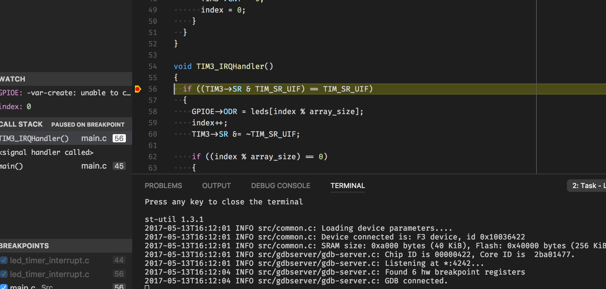

# vscode-stm32-template
Visual Studio Code template project for STM32 boards

I've been lately involved into embedded programming (nothing really serious
and fancy, just basic stuff for an university exam), in particular with ST
microdevices.

Not sure about the others in the world, but at least here all professors use
Windows as reference operating system, perhaps due to the fact that most of the
IDEs that can automate most of the work to program these devices are avaiable on
Windows.

I'm totally fine with that. Thing is, as I am a Mac user, this would mean for me:

1. Install a virtualisation software on my computer (VirtualBox, Veertu)
2. Find a Windows license somewhere
3. Install Windows on my machine
4. Download and install the selected IDE (IAR, in my case)
5. Run the virtual machine everytime I want to hack with the board.

Hmm...no. It would have completely destroyed my wish to use that board from
the beginning, and I wanted to use my tools and my OS.

Therefore I've been digging into the topic for a while and I'm happy to say
I've reached a good tradeoff that I published as a template on Github:
[vscode-stm32-template](https://github.com/XVincentX/vscode-stm32-template)

This is the template project I'm using for all the things I've been doing
around with this board and so far I am happy with that.

More over I've integrated most of the common commands as tasks in VSCode so
that I never have to touch the terminal. Also, it is able to connect to the
`stlink` GDB debugger instance, and follow your code line by line. Pretty!

The most important thing, if you're trying this template eventually with your
board, is to make sure you modify the `Makefile` and set your [board model](https://github.com/XVincentX/vscode-stm32-template/blob/master/Makefile#L101) as
well as the [firmware to load](https://github.com/XVincentX/vscode-stm32-template/blob/master/Makefile#L56)
and [link script](https://github.com/XVincentX/vscode-stm32-template/blob/master/Makefile#L134)

Once done, you should be good to go.
